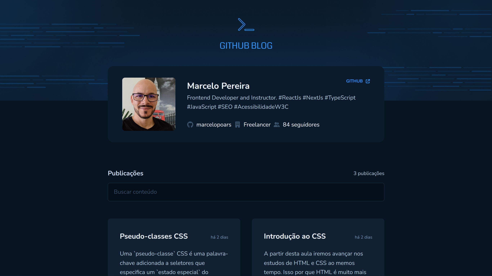

# Github BLog

## Ignite | Rocketseat: Desafio React

## Sobre o projeto

Coffee Delivery é uma página web (SPA) de catálogo e compra de cafés desenvolvida com ReactJs.

Este projeto é um dos desafios da trilha de React do Ignite - Rocketseat.

## Tecnologias

- ReactJs
- Vite
- TypeScript
- Github API
- Styled-comonents
- React Hook Form
- Zod
- Vercel
